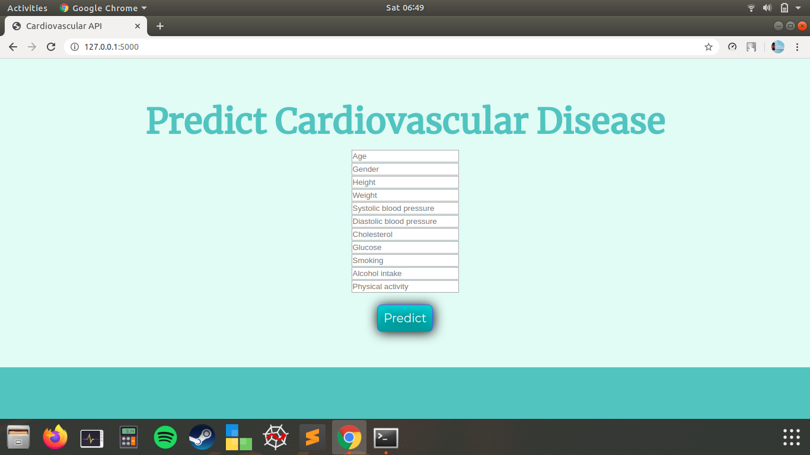

# Cardiovascular-Prediction-Deployment

This is a project to elaborate the cardiovascular predictive model and its deployment for production using Flask API

# Prerequisites

You must have sklearn, pandas and Flask (for API) installed.

# Project Structure

This project has two major parts :

model.py - This contains code for our model to predict absence or presence of disease based on trainign data in 

'raw_cardio.csv' file.

app.py - This contains Flask APIs that receives patient details through GUI or API calls, computes the precited value based 

on our model and returns it.

# Running the project

Ensure that you are in the project home directory. Create the machine learning model by running below command -

python model.py

This would create a serialized version of our model into a file model.pkl

Run app.py using below command to start Flask API

python app.py

By default, flask will run on port 5000.

Navigate to URL http://localhost:5000

You should be able to view the homepage as below : alt text

Enter valid numerical values in all input boxes and hit Predict.

If everything goes well, you should be able to see the absence or presence of cardiovascular disease on the HTML page!

